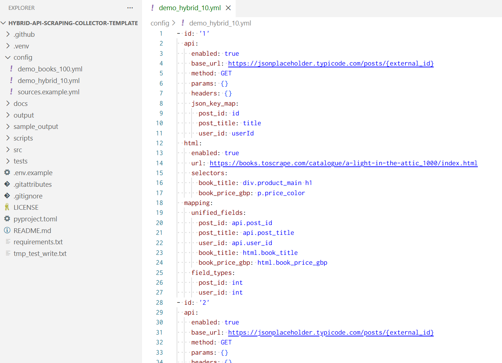
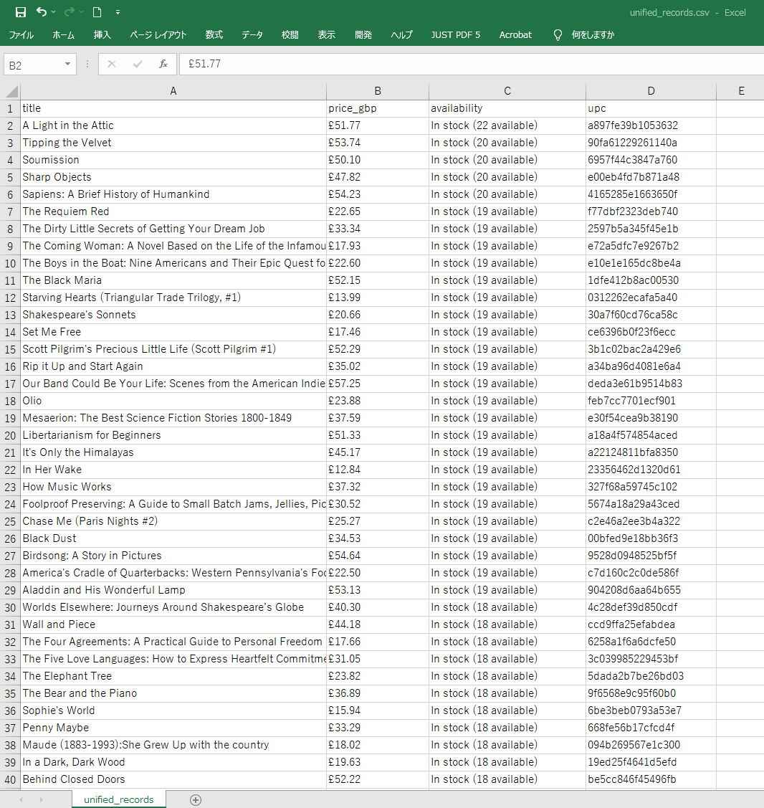

# Hybrid-API-Scraping-Collector-Template

[](https://github.com/ryuhei-py/Hybrid-API-Scraping-Collector-Template/actions/workflows/ci.yml)
[](LICENSE)
[](pyproject.toml)
[](https://github.com/astral-sh/ruff)
[](https://docs.pytest.org/)


A config-driven Python template for collecting and unifying data from **REST APIs (JSON)** and **HTML pages (CSS selectors)** into a single, validated record set—exported as **CSV + JSON**.

This repository is intentionally small and practical: a clear CLI entrypoint, deterministic (offline) tests, CI lint/test gates, and well-defined extension seams for client-specific collectors.

---

## Demo Screenshots

* Demo Screenshots

| Config (API + HTML → unified schema) | CLI run (export 100 records) | Output preview (CSV in Excel) |
| --- | --- | --- |
|  |  |  |

> Demo sources shown: JSONPlaceholder + Books to Scrape (public test sites). Use your own endpoints/targets for real projects.

---

## Table of Contents

- [Highlights](#highlights)
- [What It Produces](#what-it-produces)
- [Quickstart](#quickstart)
- [Installation](#installation)
- [Configuration](#configuration)
  - [Config File Shape](#config-file-shape)
  - [Source Schema](#source-schema)
  - [API Collection](#api-collection)
  - [HTML Collection](#html-collection)
  - [Unified Mapping](#unified-mapping)
  - [Type Casting](#type-casting)
  - [Environment Variables](#environment-variables)
  - [URL Templating Context](#url-templating-context)
- [Usage](#usage)
- [How It Works](#how-it-works)
- [Validation Behavior](#validation-behavior)
- [Retries and Error Handling](#retries-and-error-handling)
- [Outputs](#outputs)
- [Testing](#testing)
- [Operations](#operations)
- [Security, Compliance, and Responsible Use](#security-compliance-and-responsible-use)
- [Project Layout](#project-layout)
- [Limitations](#limitations)
- [Extension Points](#extension-points)
- [License](#license)
- [Related Documentation](#related-documentation)

---

## Highlights

- **Hybrid collection**: collect from an API and an HTML page in one run, then unify both into a single schema.
- **Config-first**: add or modify sources by editing YAML (minimal code changes).
- **Deterministic tests**: unit + integration-style tests mock HTTP; CI does not rely on live endpoints.
- **Modular architecture**: config → fetch → normalize → validate → export are separated into dedicated modules.
- **Practical CLI**: one command to run the pipeline; predictable CSV/JSON outputs.

---

## What It Produces

For each configured source, the pipeline emits **one unified record** (one record per source). Results are written to the selected output directory:

- `unified_records.csv`
- `unified_records.json`

---

## Quickstart

```bash
# 1) Create and activate a virtual environment
python -m venv .venv
# Windows:
#   .venv\Scripts\activate
# macOS/Linux:
#   source .venv/bin/activate

# 2) Install dependencies and the package
pip install -U pip
pip install -r requirements.txt
pip install -e .

# 3) Run using the example config
python -m hybrid_collector.cli \
  --config config/sources.example.yml \
  --output-dir sample_output
````

Dry-run (skips export but still performs fetch/scrape/normalize/validate):

```bash
python -m hybrid_collector.cli --config config/sources.example.yml --dry-run
```

---

## Installation

### Requirements

* Python 3.11+ recommended (see `.github/workflows/ci.yml` for the currently tested versions)

### Install

```bash
pip install -r requirements.txt
pip install -e .
```

---

## Configuration

### Config File Shape

The config file is a **YAML list**. Each list item defines one source.

○ Correct:

```yaml
- id: my_source
  api: { ... }
  html: { ... }
  mapping: { ... }
```

× Not supported by this implementation:

```yaml
sources:
  - id: my_source
    ...
```

---

### Source Schema

Each source supports:

* `id` (required): string identifier
* `api` (optional): API collection settings
* `html` (optional): HTML collection settings
* `mapping` (required): unified schema + type rules

A source must include **at least one** of `api` or `html`.

---

### API Collection

API data is extracted from JSON using dot-path expressions.

```yaml
api:
  enabled: true              # default: true
  base_url: "https://example.com/api/items/{external_id}"
  method: "GET"              # default: GET
  params: {}
  headers: {}
  json_key_map:
    item_id: "id"
    title: "data.title"
    price: "data.pricing.amount"
    first_tag: "tags.0"
```

**JSON path behavior**

* Dot-separated traversal supports dictionaries (`data.title`)
* Numeric segments are treated as list indices (`tags.0`)
* Missing keys/invalid traversal yields `null` (not an exception)

---

### HTML Collection

HTML fields are extracted using CSS selectors (BeautifulSoup + soupsieve).

```yaml
html:
  enabled: true              # default: true
  url: "https://example.com/items/{external_id}"
  selectors:
    page_title: "h1"
    canonical_url: "link[rel='canonical']::attr(href)"
```

**Selector behavior**

* Uses the **first** match for each selector
* No match yields `null`
* Attribute extraction is supported via: `::attr(name)`
* Only `::attr(...)` is implemented (there is no separate `::text` operator; plain selectors extract text)

---

### Unified Mapping

`mapping.unified_fields` defines the output schema and where each field comes from:

* `"api.<key>"` reads from the API extraction result dictionary
* `"html.<key>"` reads from the HTML extraction result dictionary

```yaml
mapping:
  unified_fields:
    id: "api.item_id"
    title: "api.title"
    price: "api.price"
    page_title: "html.page_title"
    canonical_url: "html.canonical_url"
```

If a mapping expression is invalid or cannot be resolved, the resulting unified value becomes `null`.

---

### Type Casting

Optionally cast unified fields using `mapping.field_types`:

```yaml
mapping:
  unified_fields:
    id: "api.item_id"
    price: "api.price"
  field_types:
    id: "int"
    price: "float"
```

Supported types:

* `int`
* `float`

Failed casts produce `null` (not an exception).

---

### Environment Variables

All string values in the YAML are processed with environment variable expansion (e.g., `${API_TOKEN}`).

Example:

```yaml
api:
  headers:
    Authorization: "Bearer ${API_TOKEN}"
```

Notes:

* `.env.example` is provided as a reference.
* The CLI does **not** automatically load `.env`. Provide environment variables via your shell, CI secrets, or a wrapper script.

---

### URL Templating Context

`api.base_url` and `html.url` support Python `str.format(**context)` placeholders.

The CLI currently provides:

* `{external_id}` → the source `id`

Example:

```yaml
api:
  base_url: "https://example.com/api/items/{external_id}"
html:
  url: "https://example.com/items/{external_id}"
```

If a URL uses an unknown placeholder, that collector fails for the source and the pipeline continues to the next source.

---

## Usage

### Run a collection

```bash
python -m hybrid_collector.cli \
  --config config/sources.example.yml \
  --output-dir output/runs/demo_001
```

### Dry-run (no export)

```bash
python -m hybrid_collector.cli --config config/sources.example.yml --dry-run
```

---

## How It Works

For each source:

1. Load and validate YAML config
2. Fetch API JSON (if enabled)
3. Fetch and parse HTML (if enabled)
4. Normalize API + HTML values into a unified record via `mapping.unified_fields`
5. Validate required fields (see next section)
6. Export all unified records to CSV + JSON (unless `--dry-run`)

---

## Validation Behavior

* The CLI treats **all keys in `mapping.unified_fields` as required**.
* Validation issues are reported to stdout, but the CLI does not fail the run by default.
* If a source errors during collection (API/HTML), it is skipped; other sources continue.

---

## Retries and Error Handling

Both the API and HTML collectors retry on:

* network exceptions (`requests` errors)
* HTTP **5xx** responses

They do **not** retry on HTTP **4xx** responses.

Defaults:

* `timeout = 10s`
* `max_retries = 3`

Notes:

* Retries are immediate (no exponential backoff/jitter in the current implementation).

---

## Outputs

Exports are written to the output directory:

* `<output-dir>/unified_records.csv`
* `<output-dir>/unified_records.json`

Important:

* Filenames are fixed; re-running to the same output directory overwrites these files.
* For repeatable runs, use a timestamped output directory.

Example (macOS/Linux):

```bash
python -m hybrid_collector.cli \
  --config config/sources.example.yml \
  --output-dir "output/runs/$(date +%Y%m%d_%H%M%S)"
```

---

## Testing

Run tests:

```bash
pytest -q
```

Run lint:

```bash
ruff check src tests
```

Tests are designed to be deterministic: HTTP is mocked so CI does not rely on live endpoints.

---

## Operations

This template is designed to run as a single-shot job:

* local runs for development and iteration
* scheduled runs via cron / Task Scheduler / CI runners
* output artifacts collected downstream (S3, Drive, a data pipeline, etc.)

A lightweight scheduling reference is included in `scheduler_stub.py` (documentation-oriented; not a daemon).

---

## Security, Compliance, and Responsible Use

This repository is a general-purpose collector template. You are responsible for:

* collecting only data you are authorized to access
* respecting website Terms of Service
* respecting robots.txt policies (this tool does not enforce robots.txt)
* implementing appropriate request pacing and identification headers (e.g., User-Agent) where required

Do not use this template to bypass access controls (CAPTCHAs, authentication barriers, paywalls, or other restrictions).

---

## Project Layout

```text
config/
  sources.example.yml
docs/
  architecture.md
  CONFIG_GUIDE.md
  operations.md
  testing.md
  SECURITY_AND_LEGAL.md
src/hybrid_collector/
  cli.py
  config.py
  api_client.py
  scraper.py
  normalizer.py
  validator.py
  exporter.py
  scheduler_stub.py
tests/
  test_*.py
```

---

## Limitations

* One unified record per source (no built-in pagination to produce multiple records per source).
* No persistence layer (no SQLite/Postgres; export-only).
* No built-in rate limiting or exponential backoff/jitter.
* No structured logging/metrics (stdout prints only).
* `.env` is not auto-loaded (environment variables must be set externally).

---

## Extension Points

Common, high-value extensions:

* **Rate limiting + backoff**: add exponential backoff with jitter and per-host throttling.
* **Optional vs required fields**: configure required fields instead of treating all unified keys as required.
* **Pagination / multi-record output**: produce multiple rows per source for list endpoints.
* **Persistence**: store raw + unified records in SQLite/Postgres; add incremental runs and deduplication.
* **Observability**: structured logs, per-source timings, and metrics hooks.
* **Additional exporters**: wire the existing Excel exporter into the CLI; add Parquet/Arrow.

---

## License

MIT (see `LICENSE`).

---

## Related Documentation

* `docs/architecture.md` — architecture and data flow
* `docs/CONFIG_GUIDE.md` — configuration guidance
* `docs/operations.md` — operational run patterns
* `docs/testing.md` — running tests and CI checks
* `docs/SECURITY_AND_LEGAL.md` — security and legal considerations